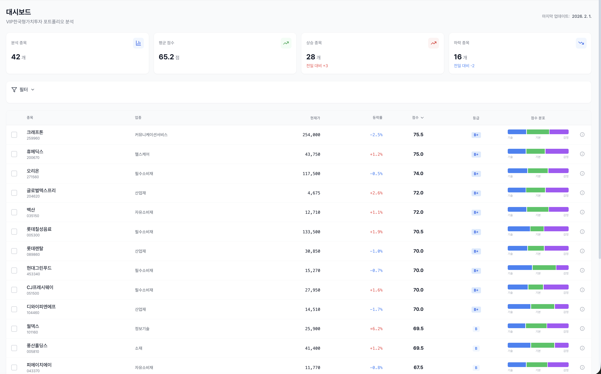
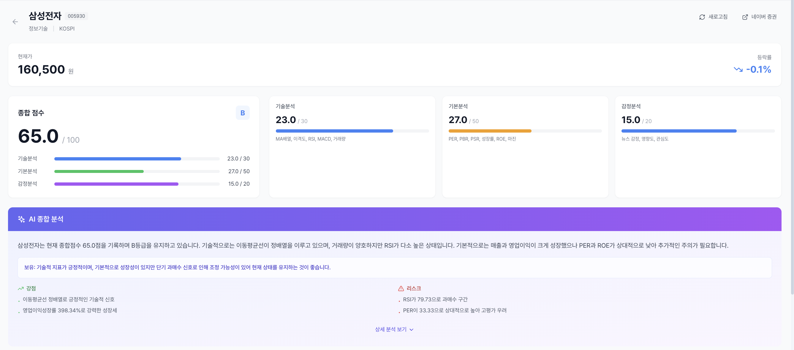
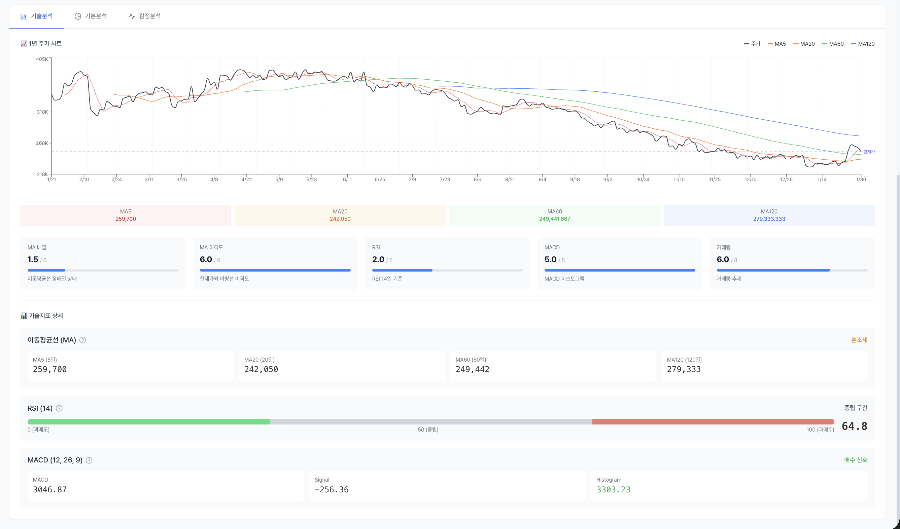
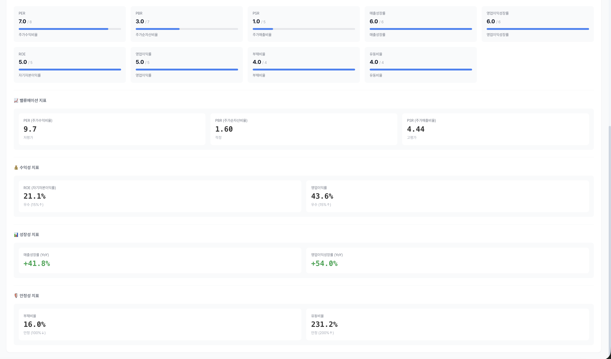

# Stock Analysis Dashboard

[](https://www.python.org/)
[](https://fastapi.tiangolo.com/)
[](https://react.dev/)
[](https://www.typescriptlang.org/)
[](#testing)
[](LICENSE)

> [한국어 문서](README_KO.md)

A comprehensive Korean stock analysis system that combines **technical analysis**, **fundamental analysis**, and **sentiment analysis** to provide investment scoring for KOSPI/KOSDAQ stocks.

**Live Demo**: [https://frontend-pi-coral-73.vercel.app](https://frontend-pi-coral-73.vercel.app)

## Features

### Multi-Dimensional Scoring (100 points)
- **Technical Analysis (30 pts)** - MA arrangement, divergence, RSI, MACD, volume
- **Fundamental Analysis (50 pts)** - PER, PBR, PSR, ROE, growth, stability
- **Sentiment Analysis (20 pts)** - News sentiment (OpenAI), manual rating override

### AI-Powered Features
- **LLM Commentary**: Automated Korean investment commentary using GPT-4o-mini
- **News Sentiment Analysis**: Automatic sentiment classification of financial news
- **Manual Override**: Users can rate news manually (-10 to +10) to replace automatic analysis

### Dashboard Pages
| Page | Description |
|------|-------------|
| Dashboard | Portfolio overview with stats cards, stock table, sector filters |
| Stock Detail | 3-tab analysis (Technical / Fundamental / Sentiment) with price chart |
| Ranking | Top/bottom ranked stocks by score |
| Compare | Side-by-side comparison of up to 4 stocks |
| Portfolio | Portfolio CRUD with weighted scoring |
| History | Score trend tracking (7d / 30d / 90d / 1yr) |
| Backtesting | Technical score-based buy/sell simulation |
| Settings | Theme (Light/Dark/System), email alerts, data export |

## Architecture

```
[Vercel]           [Cloud Run]           [Supabase]       [SQLite]
 React App    -->   FastAPI Backend  -->  PostgreSQL   +   Price History
 (Frontend)         (Docker)              (Analysis)       (Local OHLCV)

                    [GitHub Actions]
                     Daily price collection
                     Quarterly financials
                     Sentiment analysis
```

## Tech Stack

### Backend
| Technology | Purpose |
|------------|---------|
| FastAPI | REST API framework |
| Supabase | Cloud database (PostgreSQL) |
| SQLite + SQLAlchemy | Local price history |
| pykrx | Korean stock data (backup) |
| KIS API | Korea Investment & Securities (real-time) |
| OpenAI API | Sentiment analysis & LLM commentary |
| pandas / numpy / ta | Data processing & technical indicators |
| pytest | Testing (159 tests) |

### Frontend
| Technology | Purpose |
|------------|---------|
| React 18 + TypeScript | UI framework |
| Vite 6 | Build tool |
| TanStack Query | Server state management |
| Zustand | Client state management |
| Tailwind CSS | Styling with dark mode |
| Recharts | Data visualization |
| Lightweight Charts | Interactive price charts |
| React Router 6 | SPA routing |

### Data Sources
- **KIS API** (Korea Investment & Securities) - Real-time prices
- **pykrx** - Historical price data (fallback)
- **Naver Finance** - Financial statements, valuation metrics, sector info
- **Google Trends** - Search trend data
- **Naver News** - Financial news crawling

## Project Structure

```
stock_analysis/
├── backend/
│   ├── app/
│   │   ├── api/                 # API endpoints
│   │   │   ├── stocks.py        # Stock list, detail, overview, sectors
│   │   │   ├── analysis.py      # Analysis, commentary, news, sentiment
│   │   │   ├── portfolios.py    # Portfolio CRUD, scoring
│   │   │   ├── backtest.py      # Backtesting engine
│   │   │   └── alerts.py        # Score change alerts, email
│   │   ├── collectors/          # Data collectors
│   │   │   ├── kis_api.py       # KIS API (auto token refresh, rate limit)
│   │   │   ├── pykrx_collector.py
│   │   │   ├── naver_finance.py # Financial data & sector info
│   │   │   ├── news_collector.py
│   │   │   └── google_trends.py
│   │   ├── services/            # Business logic
│   │   │   ├── technical.py     # Technical analysis (30 pts)
│   │   │   ├── fundamental.py   # Fundamental analysis (50 pts)
│   │   │   ├── sentiment.py     # Sentiment analysis (20 pts)
│   │   │   ├── scoring.py       # Score aggregation & grading
│   │   │   ├── commentary.py    # LLM commentary generation
│   │   │   ├── backtesting.py   # Backtesting engine
│   │   │   └── email_service.py # SMTP email notifications
│   │   ├── analyzers/           # Analysis modules
│   │   │   ├── indicators.py    # MA, RSI, MACD, volume
│   │   │   └── openai_sentiment.py
│   │   ├── db/                  # Database layer
│   │   │   ├── sqlite_db.py     # Price history (local)
│   │   │   └── supabase_db.py   # Analysis data (cloud)
│   │   ├── models/              # Pydantic models
│   │   └── main.py              # FastAPI app entry
│   ├── scripts/                 # Data collection scripts
│   ├── tests/                   # 159 unit tests
│   ├── Dockerfile               # Cloud Run container
│   └── requirements.txt
├── frontend/
│   ├── src/
│   │   ├── pages/               # 8 page components
│   │   ├── components/          # dashboard, charts, analysis, common
│   │   ├── services/api.ts      # Axios API client
│   │   ├── stores/              # Zustand (stock, theme)
│   │   ├── types/               # TypeScript interfaces
│   │   └── lib/                 # Utilities
│   ├── vercel.json              # Vercel SPA config
│   └── package.json
├── .github/workflows/           # 3 GitHub Actions pipelines
├── docker-compose.yml
└── docs/
```

## Quick Start

### Prerequisites
- Python 3.11+
- Node.js 18+
- Supabase account
- OpenAI API key
- KIS API credentials (optional)

### Backend

```bash
cd backend
python -m venv venv
source venv/bin/activate  # Windows: venv\Scripts\activate
pip install -r requirements.txt

# Configure environment
cp .env.example .env
# Edit .env with your credentials

# Start server
uvicorn app.main:app --reload --port 8000
```

### Frontend

```bash
cd frontend
npm install
npm run dev
```

Access at `http://localhost:5173`

### Environment Variables

Create `backend/.env`:

```env
# Supabase
SUPABASE_URL=https://your-project.supabase.co
SUPABASE_KEY=your-anon-key

# OpenAI
OPENAI_API_KEY=sk-your-api-key

# KIS API (optional - for real-time prices)
KIS_APP_KEY=your-app-key
KIS_APP_SECRET=your-app-secret

# SMTP (optional - for email alerts)
SMTP_SERVER=smtp.gmail.com
SMTP_PORT=587
SMTP_USER=your-email
SMTP_PASSWORD=your-app-password

# Database
SQLITE_DB_PATH=./data/price_history.db

# CORS
CORS_ORIGINS=http://localhost:3000,http://localhost:5173
```

## API Endpoints

### Stocks
| Method | Endpoint | Description |
|--------|----------|-------------|
| GET | `/api/stocks` | List stocks (filter, sort, paginate) |
| GET | `/api/stocks/{code}` | Stock detail |
| GET | `/api/stocks/{code}/history` | Price history |
| GET | `/api/stocks/overview` | Dashboard statistics |
| GET | `/api/stocks/sectors` | Sector list |
| GET | `/api/stocks/compare` | Compare multiple stocks |

### Analysis
| Method | Endpoint | Description |
|--------|----------|-------------|
| GET | `/api/analysis/{code}` | Analysis results |
| POST | `/api/analysis/{code}/run` | Run new analysis |
| GET | `/api/analysis/{code}/commentary` | AI commentary |
| GET | `/api/analysis/{code}/news` | News list |
| PUT | `/api/analysis/{code}/news/{id}/rate` | Rate news (-10 to +10) |
| PUT | `/api/analysis/{code}/news/rate-all` | Bulk rate unrated news |
| GET | `/api/analysis/{code}/sentiment-score` | Sentiment score |
| GET | `/api/analysis/{code}/history` | Score history |
| GET | `/api/analysis/ranking` | Score ranking |

### Portfolios
| Method | Endpoint | Description |
|--------|----------|-------------|
| GET | `/api/portfolios` | List portfolios |
| POST | `/api/portfolios` | Create portfolio |
| GET | `/api/portfolios/{id}` | Portfolio detail |
| PUT | `/api/portfolios/{id}` | Update portfolio |
| DELETE | `/api/portfolios/{id}` | Delete portfolio |
| POST | `/api/portfolios/{id}/stocks` | Add stock |
| DELETE | `/api/portfolios/{id}/stocks/{code}` | Remove stock |
| PUT | `/api/portfolios/{id}/stocks/{code}/weight` | Adjust weight |
| GET | `/api/portfolios/{id}/score` | Portfolio score |

### Backtest & Alerts
| Method | Endpoint | Description |
|--------|----------|-------------|
| POST | `/api/backtest/{code}/run` | Run backtest |
| GET | `/api/backtest/{code}/date-range` | Available date range |
| GET | `/api/alerts/score-changes` | Recent score changes |
| POST | `/api/alerts/send-alert-email` | Send email alert |

## Scoring System

### Grade Table

| Grade | Score | Description |
|-------|-------|-------------|
| A+ | 90-100 | Excellent |
| A | 80-89 | Very Good |
| B+ | 70-79 | Good |
| B | 60-69 | Above Average |
| C+ | 50-59 | Average |
| C | 40-49 | Below Average |
| D | 30-39 | Poor |
| F | 0-29 | Very Poor |

### Score Breakdown

```
Total (100) = Technical (30) + Fundamental (50) + Sentiment (20)

Technical (30):            Fundamental (50):          Sentiment (20):
├── MA Arrangement: 6      ├── PER: 8                 ├── News Sentiment: 10
├── MA Divergence: 6       ├── PBR: 7                 ├── News Impact: 6
├── RSI: 5                 ├── PSR: 5                 └── News Volume: 4
├── MACD: 5                ├── Revenue Growth: 6
└── Volume: 8              ├── OP Growth: 6
                           ├── ROE: 5
                           ├── OP Margin: 5
                           ├── Debt Ratio: 4
                           └── Current Ratio: 4
```

## Deployment

### Production Architecture

| Component | Platform | URL |
|-----------|----------|-----|
| Frontend | Vercel | https://frontend-pi-coral-73.vercel.app |
| Backend | Google Cloud Run (Seoul) | https://stock-analysis-backend-675597240676.asia-northeast3.run.app |
| Database | Supabase (PostgreSQL) | Cloud managed |
| CI/CD | GitHub Actions | 3 automated pipelines |

### Deploy Backend (Cloud Run)

```bash
# Build & push Docker image
gcloud builds submit --tag asia-northeast3-docker.pkg.dev/PROJECT_ID/stock-analysis/backend:latest \
  --region=asia-northeast3 ./backend

# Deploy to Cloud Run
gcloud run deploy stock-analysis-backend \
  --image=asia-northeast3-docker.pkg.dev/PROJECT_ID/stock-analysis/backend:latest \
  --region=asia-northeast3 --allow-unauthenticated --port=8080 \
  --memory=512Mi --cpu=1 --min-instances=0 --max-instances=3 \
  --env-vars-file=backend/env.yaml
```

### Deploy Frontend (Vercel)

```bash
cd frontend
vercel --prod
# Set VITE_API_URL environment variable to Cloud Run URL
```

### Docker (Local)

```bash
docker-compose up -d
# Frontend: http://localhost:3000
# Backend:  http://localhost:8000
```

## GitHub Actions CI/CD

| Workflow | Schedule | Description |
|----------|----------|-------------|
| `collect-prices.yml` | Weekdays 20:30 KST | Price collection + technical indicators + scoring |
| `collect-quarterly.yml` | Every quarter | Financial statements & valuation metrics |
| `collect-sentiment.yml` | Mon/Thu 21:00 KST | News collection & sentiment analysis |

## Database Schema

### Supabase (PostgreSQL) - Cloud
| Table | Description |
|-------|-------------|
| `stocks_anal` | Stock master (code, name, sector, market, financials) |
| `analysis_results_anal` | Analysis scores (technical, fundamental, sentiment, total, grade) |
| `news_ratings_anal` | News items with manual ratings (-10 to +10) |
| `portfolios_anal` | Portfolio definitions |
| `portfolio_stocks_anal` | Portfolio holdings with weights |
| `sector_averages_anal` | Sector benchmark metrics |

### SQLite - Local
| Table | Description |
|-------|-------------|
| `price_history` | Daily OHLCV data |
| `technical_indicators` | Pre-calculated MA, RSI, MACD, volume ratio |

## Testing

```bash
cd backend
pytest tests/ -v
# 159 passed
```

```bash
cd frontend
npx tsc --noEmit   # TypeScript check
npx vite build      # Build verification
```

## Screenshots

### 1. Main Dashboard


Portfolio summary with stats cards, stock table with real-time prices, score distribution bars, and grade indicators.

### 2. Stock Detail - AI Commentary


Comprehensive analysis with AI-generated Korean investment commentary, score breakdown, and key insights.

### 3. Technical Analysis


Interactive price chart with MA overlays, RSI gauge, MACD indicators, and volume analysis.

### 4. Fundamental Analysis


Financial metrics organized by valuation, profitability, growth, and stability categories.

### 5. Sentiment Analysis & News Rating


Manual news rating interface (-10 to +10) with real-time score recalculation.

## Roadmap

- [x] Phase 1: Core System (Week 1-4)
  - [x] Data collection infrastructure (KIS, pykrx, Naver Finance, News)
  - [x] Analysis engine (Technical + Fundamental + Sentiment)
  - [x] React dashboard with stock table
  - [x] LLM commentary & manual news rating

- [x] Phase 2: Advanced Features (Week 5-8)
  - [x] Stock comparison (up to 4 stocks)
  - [x] Analysis history tracking
  - [x] Backtesting engine (200-day sliding window)
  - [x] Alert system (toast, browser notification, email)
  - [x] Dark mode (Light / Dark / System)
  - [x] Portfolio simulation (CRUD, weight, scoring)
  - [x] Docker + Cloud Run + Vercel deployment
  - [x] GitHub Actions automated data pipelines

## Contributing

Contributions are welcome! Please feel free to submit a Pull Request.

1. Fork the repository
2. Create your feature branch (`git checkout -b feature/AmazingFeature`)
3. Commit your changes (`git commit -m 'Add some AmazingFeature'`)
4. Push to the branch (`git push origin feature/AmazingFeature`)
5. Open a Pull Request

## License

This project is licensed under the MIT License - see the [LICENSE](LICENSE) file for details.

## Disclaimer

This software is for educational and informational purposes only. It is not intended to provide investment advice. Always conduct your own research and consult with a qualified financial advisor before making investment decisions.

## Acknowledgments

- [pykrx](https://github.com/sharebook-kr/pykrx) - Korean stock data library
- [FastAPI](https://fastapi.tiangolo.com/) - Modern Python web framework
- [Supabase](https://supabase.com/) - Open source Firebase alternative
- [OpenAI](https://openai.com/) - GPT-4o-mini for sentiment analysis & commentary
- [TradingView Lightweight Charts](https://github.com/nicehash/lightweight-charts) - Interactive price charts
